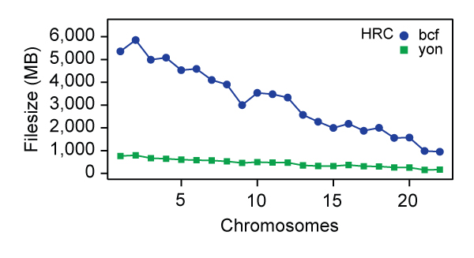
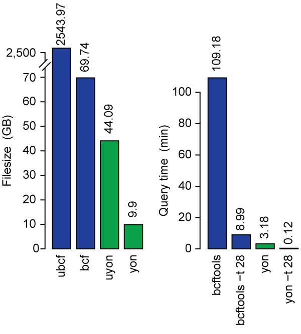
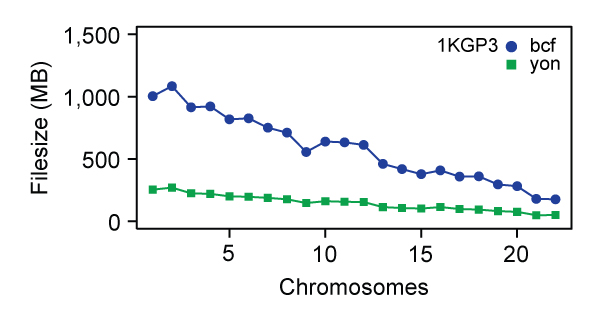
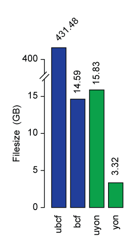

[](https://travis-ci.org/mklarqvist/tachyon)
[](https://github.com/mklarqvist/Tachyon/releases)
[](LICENSE)

<div align="center">
<br><br>
</div>

Tachyon, or `YON` for short, is an open source C++ software library for reading, writing, and manipulating sequence variant data in a lossless and bit-exact representation. It is completely compatible with BCF/VCF. It was developed with a focus on enabling fast experimentation and storage of population-scaled datasets.

## Perfomance
For reference, we compared yon to bcf on a server running Linux Ubuntu, with an Intel Xeon E5-2697 v3 processor, 64GB of DDR4-2133 RAM, and a pair of Intel SSE 750 NVMe drives running in RAID-0.

The following tests were run on the first release of [Haplotype Reference Consortium](http://www.haplotype-reference-consortium.org/) (HRC) data. There are ~39 million phased SNPs in 32,488 samples. Left panel: Filesizes for chromosomes 1-22. Right panel: We generated a yon archive for this dataset (left) and compared file sizes for both uncompressed (ubcf and uyon) and compressed data (bcf and yon) and next retrieved the site-specific information only (dropping all FORMAT fields; right).

Compression Ratio / Chromosome | Compression Ratio
------------------|-------------------
 | 

The following tests were run on the [1000 Genomes Phase 3](http://www.internationalgenome.org/) (1KGP3) data. There are ~84.4 million phased SNPs in 2,504 samples from 26 distinct populations.

Compression Ratio / Chromosome | Compression Ratio
------------------|-------------------
 | 

ubcf: uncompressed bcf; uyon: uncompressed yon; 1 GB = 1000 * 1000 * 1000 b

### Evaluation performance
The following tests were run to benchmark the processing time of various `yon` archives. For these tests we use three distinct datasets: 1) [1000 Genomes Phase 3](http://www.internationalgenome.org/) (1KGP3) chromosome 11; 2) [Haplotype Reference Consortium](http://www.haplotype-reference-consortium.org/) (HRC) chromosome 11; and 3) [Human Genome Diversity Project](http://www.hagsc.org/hgdp/) (HGDP) chromosome 10. 

| Dataset     | Variants | #INFO | #FORMAT | ubcf      | bcf       | uyon      | yon       |
|-------------|----------|-------|---------|-----------|-----------|-----------|-----------|
| 1kgp3-chr11 | 4045628  | 24    | 1       | 20.60 GB  | 633.70 MB | 670.29 MB | 157.28 MB |
| HRC-chr11   | 1936990  | 6     | 1       | 125.90 GB | 3.48 GB   | 1.47 GB   | 461.96 MB |
| HGDP-chr10  | 3766673  | 24    | 9       | 73.93 GB  | 19.07 GB  | 67.76 GB  | 14.40 GB  |

Throughput is measure in megabytes per second. The test involves: 1) reading raw data (`read`); 2) decrypting and uncompressing raw data (`decompress`); 3) copying and constructing data containers from byte streams (`container eval`); 4) constructing lazy-evaluated `yon1_t` records from data containers (`lazy eval`). Which level of evaluation you would use in your application depends on the use-case&mdash;but most applications should be able to operate directly from the byte-streams (`decompress`).

| Dataset     | Threads | Read (MB/s) | Decompress (MB/s) | Container Eval (MB/s) | Lazy Eval (MB/s) |
|-------------|---------|-------------|-------------------|-----------------------|------------------|
| 1kgp3-chr11 | 1       | 799.7     | 231.6           | 63.3               | 14.5          |
|             | 28      | 847.34     | 2242.9           | 614.5               | 135.9          |
| HRC-chr11   | 1       | 1717.4     | 192.7           | 131.1               | 14.9          |
|             | 28      | 1702.2     | 2613.0           | 1940.1               | 157.7          |
| HGDP-chr10  | 1       | 1756.8     | 321.2           | 50.2               | 48.8          |
|             | 28      | 1733.3     | 5451.9            | 442.5               | 449.5          |

---  

## Installation
For Ubuntu, Debian, and Mac systems, installation is easy: just run
```bash
git clone --recursive https://github.com/mklarqvist/tachyon
cd tachyon
./install.sh
```
Note the added `--recursive` flag to the clone request. This flag is required to additionally pull down the latest third-party dependencies. The install.sh file depends extensively on `apt-get`, so it is unlikely to run without extensive modifications on non-Debian-based systems.
If you do not have super-user (administrator) privileges required to install new packages on your system then run the local installation:
```bash
./install.sh local
```
When installing locally the required dependencies are downloaded and built in the root directory. This approach will require additional effort if you intend to move the compiled libraries to a different directory.

## Documentation

* Overview.
* [Building and installing](docs/building.md)
* [Getting started](docs/getting_started.md)
* [Performance benchmarks](docs/benchmarks.md)

### Contributing

Interested in contributing? Fork and submit a pull request and it will be reviewed.

### Support
We are actively developing Tachyon and are always interested in improving its quality. If you run into an issue, please report the problem on our Issue tracker. Be sure to add enough detail to your report that we can reproduce the problem and address it. We have not reached version 1.0 and as such the specification and/or the API interfaces may change.

### Version
This is Tachyon 0.6.0. Tachyon follows [semantic versioning](https://semver.org/).

### History
Tachyon grew out of the [Tomahawk][tomahawk] project for calculating genome-wide linkage-disequilibrium.

### Author
Marcus D. R. Klarqvist (<mk819@cam.ac.uk>)  
Department of Genetics, University of Cambridge  
Wellcome Trust Sanger Institute

### Acknowledgements
[James Bonfield](https://github.com/jkbonfield), Wellcome Trust Sanger Institute  
[Petr Daněček](https://github.com/pd3), Wellcome Trust Sanger Institute  
[Richard Durbin](https://github.com/richarddurbin), Wellcome Trust Sanger Institute, and Department of Genetics, University of Cambridge  

### License
Tachyon is licensed under [MIT](LICENSE)

[openssl]:  https://www.openssl.org/
[zstd]:     https://github.com/facebook/zstd
[tomahawk]: https://github.com/mklarqvist/tomahawk
[msprime]:  https://github.com/jeromekelleher/msprime