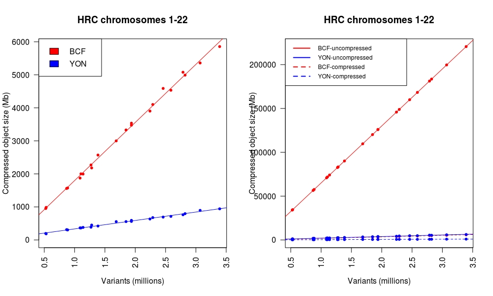

[](https://github.com/mklarqvist/Tachyon/releases)
[](https://travis-ci.org/mklarqvist/tachyon)
[](LICENSE)


# Tachyon
<div align="center">
<br><br>
</div>

Tachyon is an open source software library for storing and querying sequencing/sequence variant data in a lossless and bit-exact representation. Tachyon efficiently stores data fields by column and implicitly represent genotypic data by exploiting intrinsic genetic properties. Most genotype-specific algorithms were originally developed for [Tomahawk][tomahawk] for the purpose of calculating linkage-disequilibrium and identity-by-state in large-scale cohorts.

### Author
Marcus D. R. Klarqvist (<mk819@cam.ac.uk>)  
Department of Genetics, University of Cambridge  
Wellcome Trust Sanger Institute

### Notice!
Tachyon is under active development and the specification and/or the API interfaces may change at any time!   
Commits may break functionality!  
**THERE IS NO STABILITY PROMISE WHATSOEVER!**  

## Introduction

### Why a new framework?
There are a large number of field-specific file formats that have reached near-universal standard such as FASTA/FASTQ, SAM/BAM/uBAM/CRAM, VCF/BCF/gVCF. They all have unique file-specifications and different native toolsets interacting with them in addition to the multitude of tools developed for answering specific scientific questions. Tachyon was developed as a format-agnostic framework encapsulating all these previous standard formats in a unified database-like system constructed from generalized data-agnostic containers. The primary incentive of this project is to empower the research community with the tools required to query and interact with sequencing data.

---

### Guiding principles
* **Uniformity**. Tachyon is designed from data-agnostic STL-like containers and as such is decoupled from the higher-order file type-specific implementation details. This forces all underlying specifcations to share the same API calls.
* **User friendliness**. Tachyon is an API designed to be used by human beings and simultaneously a backbone specification consumed by machines. It puts emphasis on user experience. Tachyon follows best practices for reducing cognitive load: it offers consistent and simple APIs, it minimizes the number of user actions required for common use cases, and it provides clear and actionable feedback upon user error.
* **Modularity**. Tachyon is composed entirely of STL-like data containers that in turn are abstracted into higher-order type-specific containers. These containers are all standalone and can be plugged together with little restriction in any context.
* **Easy extensibility**. Describing novel specifcations and/or adding new functionality is simple as all basic containers are data-agnostic. Allowing for easy extensibility and to create new tools and modules allows for near-unlimited expressiveness.

---

### Highlights of Tachyon
* **Self-indexing**: Tachyon always builds the best possible index and super-index (indexing of the index for even faster queries) given the input data (irrespective of sorting). There are no external indices as data are stored in the file itself.
* **Integrity checking**: The `YON` specification enforces validity checks for each data field and across all fields through checksum validation. Guaranteed file integrity when compressing/decompressing and encrypting/decrypting.
* **Encryption**: Natively supports block-wise, field-wise, and entry-wise encryption with all commonly used encryption models and paradigms through [openssl][openssl]
* **Compression**: Tachyon files are generally many fold (in many cases many 10-100-fold) smaller than current file-formats/
* **Field-specific layout**: In principle, Tachyon is implemented as a standard column-oriented management system with several layers of domain-specific heuristics providing fast and flexible data queries.  
* **High-level API**: User-friendly C++/C API for quering, manipulating, and exploring sequence data with minimal programming experience
* **Comaptibility**: We strive to provide API calls to return YON data streams to any of the file-formats we are supplanting. This allows for immediate use of Tachyon without disrupting the existing ecosystem of tools.

---

## Benchmarks
### Simulations
We simulated haplotypes using [msprime][msprime] for a 50 megabase region for varying number of individuals (fixed parameters: recombination rate 2e-8, mutation rate 2e-8, effective population size 1e4) and concatened pairs of haplotypes together to form diploid genotypes. Decompression times were measured by `time zcat <file.bcf> > /dev/null` for `bcf` and using the API for Tachyon and timings for printing fixed-fields were measured as `time bcftools view <file.bcf> -GH > /dev/null` for `bcf` and `time tachyon view -GH > /dev/null` for Tachyon. File sizes are listed in gigabytes (1 GB = 10e9 b) and timings in seconds. All experiments were run on a single CPU.  

| Variants  | Samples  | Filesize (BCF) | Filesize (YON) | Decomp. (BCF) | Decomp. (YON) | Print sites (BCF) | Print sites (YON) |
|-----------|----------|----------------|----------------|---------------|---------------|-------------------|-------------------|
| 523,842   | 10,000   | 0.53655        | 0.16043        | 44.295        | 1.859         | 28.098            | 0.680             |
| 604,487   | 50,000   | 2.57511        | 0.59032        | 251.682       | 7.077         | 137.200           | 1.609             |
| 639,666   | 100,000  | 5.12134        | 0.99690        | 526.733       | 12.473        | 286.413           | 1.936             |
| 685,363   | 250,000  | 12.64719       | 1.90681        | 1927.011      | 24.671        | 1028.046          | 4.745             |
| 719,754   | 500,000  | 25.08209       | 3.04404        | 4139.424      | 45.247        | 2241.756          | 11.706            |  


### Real datasets
The following table shows data for the 1000 Genomes Project Phase 3 release (2,504 samples, in megabytes; 1 MB = 1E6 bytes). The uncompressed file size represents the amount of bytes needed to be parsed internally   

| Contig | BCF-compressed | BCF-uncompressed | YON-compressed | YON-uncompressed | YON-fold | BCF-fold | Uncompressed-fold |
|--------|----------------|------------------|----------------|------------------|----------|----------|-------------------|
| 1      | 1004.15        | 33140.9          | 258.842        | 1263.27          | 128.04   | 33.004   | 26.234            |
| 2      | 1084.63        | 36284.2          | 275.986        | 1347.19          | 131.47   | 33.453   | 26.933            |
| 3      | 914.54         | 29883.5          | 229.379        | 1132.73          | 130.28   | 32.676   | 26.382            |
| 4      | 922.15         | 29373.0          | 225.035        | 1146.94          | 130.53   | 31.853   | 25.610            |
| 5      | 817.85         | 26980.8          | 204.648        | 1014.88          | 131.84   | 32.990   | 26.585            |
| 6      | 826.64         | 25743.2          | 201.314        | 1016.07          | 127.88   | 31.142   | 25.336            |
| 7      | 750.82         | 24167.4          | 192.220        | 937.06           | 125.73   | 32.188   | 25.791            |
| 8      | 711.66         | 23554.5          | 180.243        | 884.54           | 130.68   | 33.098   | 26.629            |
| 9      | 556.59         | 18244.0          | 149.945        | 704.78           | 121.67   | 32.778   | 25.886            |
| 10     | 639.80         | 20455.4          | 164.439        | 799.29           | 124.40   | 31.971   | 25.592            |
| 11     | 633.70         | 20728.9          | 159.191        | 783.82           | 130.21   | 32.711   | 26.446            |
| 12     | 613.10         | 19821.2          | 157.542        | 766.12           | 125.82   | 32.330   | 25.872            |
| 13     | 460.82         | 14643.6          | 116.473        | 575.91           | 125.72   | 31.777   | 25.427            |
| 14     | 418.90         | 13604.1          | 108.813        | 525.03           | 125.02   | 32.476   | 25.911            |
| 15     | 378.46         | 12423.5          | 104.407        | 479.29           | 118.99   | 32.826   | 25.921            |
| 16     | 408.44         | 13823.2          | 116.201        | 525.16           | 118.96   | 33.843   | 26.322            |
| 17     | 358.58         | 11934.5          | 100.589        | 459.74           | 118.65   | 33.283   | 25.959            |
| 18     | 360.95         | 11616.7          | 96.252         | 462.71           | 120.69   | 32.184   | 25.106            |
| 19     | 295.92         | 9389.2           | 83.711         | 387.25           | 112.16   | 31.728   | 24.246            |
| 20     | 282.46         | 9288.6           | 77.330         | 364.36           | 120.12   | 32.885   | 25.493            |
| 21     | 180.55         | 5664.7           | 50.263         | 236.30           | 112.70   | 31.374   | 23.972            |
| 22     | 177.18         | 5654.2           | 51.468         | 229.95           | 109.86   | 31.912   | 24.589            |

  
The following table shows data for the Haplotype Reference Consortium (32,488 whole-genome sequenced samples)  

| Contig | BCF-compressed | BCF-uncompressed | YON-compressed | YON-uncompressed | YON_fold | BCF_fold | Uncompressed_fold |
|--------|----------------|------------------|----------------|------------------|----------|----------|-------------------|
| 1      | 5359.20        | 199628           | 895.46         | 5865.5           | 222.93   | 37.250   | 34.034            |
| 2      | 5855.74        | 220586           | 942.84         | 6242.9           | 233.96   | 37.670   | 35.334            |
| 3      | 4991.04        | 183499           | 796.51         | 5355.0           | 230.38   | 36.766   | 34.266            |
| 4      | 5078.87        | 181268           | 763.12         | 5488.2           | 237.53   | 35.691   | 33.029            |
| 5      | 4533.42        | 168300           | 714.14         | 4861.6           | 235.67   | 37.124   | 34.619            |
| 6      | 4588.08        | 159973           | 692.21         | 4807.6           | 231.10   | 34.867   | 33.275            |
| 7      | 4101.22        | 148866           | 676.84         | 4536.9           | 219.94   | 36.298   | 32.812            |
| 8      | 3902.68        | 145836           | 635.00         | 4224.8           | 229.66   | 37.368   | 34.519            |
| 9      | 3000.07        | 109666           | 555.14         | 3456.6           | 197.55   | 36.554   | 31.727            |
| 10     | 3536.07        | 125972           | 593.09         | 3935.3           | 212.40   | 35.625   | 32.010            |
| 11     | 3476.07        | 125957           | 561.41         | 3689.2           | 224.36   | 36.235   | 34.142            |
| 12     | 3330.20        | 120177           | 556.28         | 3661.9           | 216.04   | 36.087   | 32.819            |
| 13     | 2571.01        | 90091            | 421.10         | 2859.1           | 213.94   | 35.041   | 31.510            |
| 14     | 2270.78        | 82613            | 386.20         | 2496.6           | 213.91   | 36.381   | 33.090            |
| 15     | 1996.39        | 74080            | 379.79         | 2278.8           | 195.05   | 37.107   | 32.508            |
| 16     | 2181.47        | 83319            | 451.09         | 2612.2           | 184.70   | 38.194   | 31.896            |
| 17     | 1874.08        | 70884            | 365.79         | 2153.1           | 193.78   | 37.823   | 32.921            |
| 18     | 2001.76        | 71839            | 364.10         | 2321.1           | 197.31   | 35.888   | 30.950            |
| 19     | 1559.36        | 56480            | 312.13         | 1887.2           | 180.95   | 36.220   | 29.928            |
| 20     | 1573.38        | 57548            | 303.62         | 1878.9           | 189.54   | 36.576   | 30.628            |
| 21     | 986.49         | 34548            | 186.18         | 1221.8           | 185.56   | 35.021   | 28.275            |
| 22     | 953.16         | 34110            | 196.84         | 1156.9           | 173.29   | 35.786   | 29.484            |

  

--- 

## Getting started
### Dependencies
You will need the following dependencies:
* [zstd][zstd]: A compression library developed at Facebook
* [openssl][openssl]: An open-source library for encryption/decryption

### Building from source
Assuming the dependencies are installed then building is trivial:
```bash
git clone --recursive https://github.com/mklarqvist/tachyon
cd tachyon/build
make
```

### ABI examples
Import a `bcf` file to `yon` with a block-size of `-c` number of variants and/or `-C` number of base-pairs. If both `-c` and `-C` are set then the block breaks whenever either condition is satisfied.
```bash
tachyon import -i <file.bcf> -o <outfile.yon> -c <variants checkpoint> -C <base pair checkpoint>
```

Viewing a `yon` file
```bash
tachyon view -i <input.yon>
```

## C++ API Examples
### Standard containers
```c++
/**<
 * Tachyon: https://github.com/mklarqvist/tachyon 
 * In this example we will load data from
 * the FORMAT field GL into the iterable template class
 * `FormatContainer`. This is a complete example!
 */
#include <tachyon/variant_reader.h>

std::string my_input_file = "somefile.yon"; // Change me to an actual file that exists on your filesystem
tachyon::VariantReader reader;
reader.getSettings().loadFormat("GL");
reader.open(my_input_file);

/**<
 *  The `FormatContainer` class stores the data for each variant 
 *  for each individual as container[variant][sample][data]
 */
while(reader.nextBlock()){ // As long as there are YON blocks available
    // Meta container
    containers::MetaContainer meta(reader.block);
    // FORMAT container with float return type primitive
    containers::FormatContainer<float>* gp_container = reader.get_balanced_format_container<float>("GL", meta);
    if(gp_container != nullptr){
        for(U32 variant = 0; variant < gp_container->size(); ++variant){
            for(U32 sample = 0; sample < gp_container->at(variant).size(); ++sample){
                // Write the data to `cout` in `VCF` formatting
                utility::to_vcf_string(std::cout, gp_container->at(variant).at(sample)) << ' ';
            }
            std::cout << '\n';
        }
        std::cout << '\n';
    }
    delete gp_container;
}
```

```c++
/**<
 * Tachyon: https://github.com/mklarqvist/tachyon 
 * In this example we will load data from
 * the INFO field SVLEN into the iterable template class
 * `InfoContainer`. This is a complete example!
 */
#include <tachyon/variant_reader.h>

std::string my_input_file = "somefile.yon"; // Change me to an actual file that exists on your filesystem
tachyon::VariantReader reader;
reader.getSettings().loadInfo("SVLEN");
reader.open(my_input_file);

/**<
 * The `InfoContainer` class stores the data for each variant as
 * container[variant][data]. Both `InfoContainer` and `FormatContainer`
 * supports variant-balancing of the classes. Balancing refers to filling
 * variant sites in the file with empty objects if no target data is present
 * at that site.
 */
while(reader.nextBlock()){ // As long as there are YON blocks available
    // Meta container
    containers::MetaContainer meta(reader.block);
    // Variant-balanced
    containers::InfoContainer<U32>* info_balanced   = reader.get_balanced_info_container<U32>("SVLEN", meta);
    // Not variant-balanced 
    containers::InfoContainer<U32>* info_unbalanced = reader.get_info_container<U32>("SVLEN");
    // Print the sizes of the two containers
    // The size of the balanced container is always the number of variants
    // In contrast, the unbalanced one returns a container only for the 
    // variants with data available. 
    std::cout << info_balanced->size() << "/" << info_unbalanced->size() << '\n';
    delete info_balanced;
    delete info_unbalanced;
}
```

```c++
/**<
 * Tachyon: https://github.com/mklarqvist/tachyon 
 * In this example we will load data from
 * the INFO field MEINFO into the iterable template class
 * `InfoContainer`. This is a complete example!
 */
#include <tachyon/variant_reader.h>

std::string my_input_file = "somefile.yon"; // Change me to an actual file that exists on your filesystem
tachyon::VariantReader reader;
reader.getSettings().loadInfo("MEINFO");
reader.open(my_input_file);

/**<
 * The `InfoContainer` class has to be templated as std::string if the underlying data is of type `char`
 */
while(reader.nextBlock()){ // As long as there are YON blocks available
    // Meta container
    containers::MetaContainer meta(reader.block);
    containers::InfoContainer<std::string>* meinfo_container = reader.get_balanced_info_container<std::string>("MEINFO", meta);
    std::cout << meinfo_container->size() << std::endl;
    delete meinfo_container;
}
```

```c++
/**<
 * Tachyon: https://github.com/mklarqvist/tachyon 
 * In this example we will load data from
 * the VEP-generated CSQ string and tokenize it using
 * built-in utility functions
 */
#include <tachyon/variant_reader.h>

std::string my_input_file = "somefile.yon"; // Change me to an actual file that exists on your filesystem
tachyon::VariantReader reader;
reader.getSettings().loadInfo("CSQ");
reader.open(my_input_file);

while(reader.nextBlock()){ // As long as there are YON blocks available
    containers::MetaContainer meta(reader.block);
    containers::InfoContainer<std::string>* csq_data = reader.get_balanced_info_container<U32>("std::string", meta);
    if(it2 != nullptr){
        for(size_t i = 0; i < csq_data->size(); ++i){
            if(csq_data->at(i).size() == 0) continue;
            else {
                meta.at(i).toVCFString(std::cout, this->header);
                std::cout.put('\t');
                // Tokenize CSQ string into a vector of strings
                std::vector<std::string> ret = utility::split((*csq_data)[i],'|');
                // Dump element 6 out of ret.size() total elements
                std::cout << ret[6] << "\n";
            }
        }
    }
    delete csq_data;
}
```

---

### Genotype containers / objects
```c++
/**<
* Tachyon: https://github.com/mklarqvist/tachyon 
* The higher-order primitive GTObject allows for single-genotype
* manipulation whenever summary statistics is insufficient. There
* are three levels of return types:
* 1) The literal internal representation (preffered use). This
*    function returns the implementation representation as a generic
*    GTObject. 
* 2) Unpacked (one genotype -> one sample) GTObject but in permuted
*    order. These genotypes are in the internal sorted order and does
*    not match with the tachyon sample header
* 3) Unpacked (one genotype -> one sample) GTObject in original order.
*    These genotype objects are returned in the same order as described
*    in the tachyon sample header. 
*
* This is a complete example!
*/
#include <tachyon/variant_reader.h>

std::string my_input_file = "somefile.yon"; // Change me to an actual file that exists on your filesystem
tachyon::VariantReader reader;
reader.getSettings().loadGenotypes(true);
reader.open(my_input_file);

while(reader.nextBlock()){ // As long as there are YON blocks available
    containers::GenotypeContainer gt(reader.block);
    for(U32 i = 0; i < gt.size(); ++i){
        // All of these functions are in relative terms very expensive!
        // Avoid using them unless you absolutely have to!
        // Vector of literal genotype representations (lower level)
        std::vector<core::GTObject> objects     = gt[i].getLiteralObjects();
        // Vector of genotype objects (high level permuted)
        std::vector<core::GTObject> objects_all = gt[i].getObjects(reader.header.getSampleNumber());
        // Vector of genotype objects (high level unpermuted - original)
        std::vector<core::GTObject> objects_true = gt[i].getObjects(reader.header.getSampleNumber(), reader.block.ppa_manager);

        // Print the difference
        std::cerr << objects.size() << '\t' << objects_all.size() << '\t' << objects_true.size() << std::endl;
        // Dump data
        gt[i].getMeta().toVCFString(std::cout, reader.header, reader.block.index_entry.contigID, reader.block.index_entry.minPosition);
        utility::to_vcf_string(std::cout, objects_true) << '\n';
    }
}
```

More advanced example using genotype summary statistics
```c++
/**<
* Tachyon: https://github.com/mklarqvist/tachyon 
* In this example we will use the genotype summary statistics
* to calculate strand-specific bias of an alelle using a Fisher's 
* 2x2 exact test. This is a complete example!
*/
#include <tachyon/variant_reader.h>

std::string my_input_file = "somefile.yon"; // Change me to an actual file that exists on your filesystem
tachyon::VariantReader reader;
reader.getSettings().loadGenotypes(true);
reader.open(my_input_file);

while(reader.nextBlock()){ // As long as there are YON blocks available
    containers::GenotypeContainer gt(reader.block);
    math::Fisher fisher(); // Math class for Fisher's exact test and Chi-squared
    containers::GenotypeSum gt_summary; // Genotype summary statistics
    for(U32 i = 0; i < gt.size(); ++i){ // Foreach variant
        // If there's > 5 alleles continue
        if(gt[i].getMeta().getNumberAlleles() >= 5) continue;
        // Calculate summary statistics
        gt[i].getSummary(gt_summary);

        // Calculate total number of alt-alleles (allele 1, where 0 is ref)
        const U64 total = gt_summary.getAlleleA(1) + gt_summary.getAlleleB(1);
        const double p = fisher.fisherTest(gt_summary.getAlleleA(1), total, gt_summary.getAlleleB(1), total); // P-value for allele-bias
        if(p < 1e-3){ // If P < 0.001 report it
            gt[i].getMeta().toVCFString(std::cout, reader.header, reader.block.index_entry.contigID, reader.block.index_entry.minPosition);
            std::cout << '\t' << gt_summary << '\t' << p << '\t' << ((gt_summary.getAlleleA(1) == 0 || gt_summary.getAlleleB(1) == 0) ? 1 : 0) << '\n';
        }
        gt_summary.clear(); // Recycle summary object
    }
}
```

Calculating Ts/Tv ratio and other summary statistics
```c++
/**<
* Tachyon: https://github.com/mklarqvist/tachyon 
* In we will calculate the transition-to-transversion ratio and other
* summary statistics. This is a complete example!
*/
#include <tachyon/variant_reader.h>

std::string my_input_file = "somefile.yon"; // Change me to an actual file that exists on your filesystem
tachyon::VariantReader reader;
reader.getSettings().loadGenotypes(true);
reader.open(my_input_file);

std::vector<tachyon::core::TsTvObject> global_titv(reader.header.getSampleNumber()); // Global summary object
while(reader.nextBlock()){ // As long as there are YON blocks available
    containers::GenotypeContainer gt(this->block);
    std::vector<tachyon::core::TsTvObject> objects(this->header.getSampleNumber()); // Local summary objects
    for(U32 i = 0; i < gt.size(); ++i)
        gt[i].getTsTv(objects); // Update summary statistics for each variant site

    for(U32 i = 0; i < objects.size(); ++i)
        global[this->block.ppa_manager[i]] += objects[i]; // Update global object with unpermuted sample order
}

// Dump data to standard out
std::cout << "Sample\tTransversions\tTransitions\tTiTV\tAA\tAT\tAG\tAC\tTA\tTG\tTC\tTT\tGA\tGT\tGG\tGC\tCA\tCT\tCG\tCC\totalVariants\n";
for(U32 i = 0; i < global_titv.size(); ++i)
    std::cout << reader.header.samples[i].name << '\t' << global_titv[i] << '\n';

```

This will generate a tab-delimited output table (first three rows shown here) 
 
| Sample | Transversions | Transitions | TsTV    | AA     | AT   | AG    | AC   | TA   | TG     | TC   | TT    | GA    | GT   | GG      | GC   | CA   | CT    | CG   | CC      |  
|--------|---------------|-------------|---------|--------|------|-------|------|------|--------|------|-------|-------|------|---------|------|------|-------|------|---------|  
| 0      | 30385         | 68543       | 2.25582 | 649609 | 3183 | 17281 | 3849 | 3109 | 629125 | 4055 | 17041 | 17267 | 4009 | 1061887 | 4237 | 3897 | 16954 | 4046 | 1052277 |  
| 1      | 30744         | 68996       | 2.24421 | 649463 | 3231 | 17349 | 3885 | 3092 | 628986 | 4026 | 17192 | 17509 | 4065 | 1061550 | 4282 | 4037 | 16946 | 4126 | 1052089 |  
| 2      | 31003         | 70163       | 2.2631  | 649048 | 3282 | 17682 | 3894 | 3075 | 628845 | 4099 | 17265 | 17826 | 4160 | 1060990 | 4412 | 4013 | 17390 | 4068 | 1051703 |  

An example plot in `R`


---

### Math objects
```c++
/**<
* Tachyon: https://github.com/mklarqvist/tachyon 
* In this example we will calculate the identity-by-descent
* between samples using the math::SquareMatrix object.
*
* This is a complete example!
*/
#include <tachyon/variant_reader.h>

std::string my_input_file = "somefile.yon"; // Change me to an actual file that exists on your filesystem
tachyon::VariantReader reader;
reader.getSettings().loadGenotypes(true);
reader.open(my_input_file);

// Allocate two matrices of size N*N
// The second object is a temporary matrix used when
// genotype data is permuted.
tachyon::math::SquareMatrix<double> square(reader.header.getSampleNumber());
tachyon::math::SquareMatrix<double> square_temporary(reader.header.getSampleNumber());
U64 n_alleles = 0;
while(reader.nextBlock()){ // As long as there are YON blocks available
    containers::GenotypeContainer gt(reader.block);
    // Compare genotypes pairwise for each M in the current YON block
    for(U32 i = 0; i < gt.size(); ++i)
        gt[i].comparePairwise(square_temporary);

    // Add the data from the temporary matrix to the main matrix
    // in the unpermuted genotype order
    square.addUpperTriagonal(square_temporary, reader.block.ppa_manager);
    square_temporary.clear(); // Recycle memory

    // 2 * (Upper triagonal + diagonal) * number of variants
    // This is equivalent to (choose(N, 2) + N) * M_block
    const U64 updates = 2*((reader.header.getSampleNumber()*reader.header.getSampleNumber() - reader.header.getSampleNumber())/2 + reader.header.getSampleNumber()) * gt.size();
    n_aleles += 2*reader.header.getSampleNumber()*gt.size(); // 2*N*M_block
}
square /= n_alleles; // Divide matrix by the number of observed alleles
std::cout << square << std::endl; // Print output
```
Lets plot this output matrix in `R`
```R
# In this example we have pre-computed the identity-by-state
# matrix for the 2,504 samples from the 1000 genomes project
# using genotypes from chromosme 20.
# Calculating this matrix takes roughly ~1 hour on a single
# core on a laptop
#
# Upper triagonal similiary
diff<-read.delim("1kgp3_chr20_ibs_matrix.txt",h=F)
# Square matrix
diff2<-matrix(0,ncol(diff)-1,ncol(diff)-1)

# Utility function to convert upper triagonal matrix into
# square matrix with empty diagonal removed
helper<-function(dataset,position){ t(dataset[position,-position])+dataset[-position,position] }
for(i in 1:(ncol(diff)-1)) diff2[,i]<-helper(diff,i)

# Load sample meta data (including labels)
# Available online at http://www.internationalgenome.org/
groupings<-read.delim("integrated_call_samples_v3.20130502.ALL.panel")

# Generate some colours
library(RColorBrewer)
#colors = rainbow(length(unique(groupings$super_pop)))
colors = brewer.pal(length(unique(groupings$super_pop)), "Accent")
names(colors) = unique(groupings$super_pop)

# Load and run t-SNE with various perplexities
library(Rtsne)
tsneP10 <- Rtsne(diff2, dims = 5, perplexity=10,verbose=TRUE, max_iter = 500)
tsneP20 <- Rtsne(diff2, dims = 5, perplexity=20,verbose=TRUE, max_iter = 500)
tsneP30 <- Rtsne(diff2, dims = 5, perplexity=30,verbose=TRUE, max_iter = 500)
tsneP40 <- Rtsne(diff2, dims = 5, perplexity=40,verbose=TRUE, max_iter = 500)
tsneP50 <- Rtsne(diff2, dims = 5, perplexity=50,verbose=TRUE, max_iter = 500)

# Plot some data
plot(tsneP10$Y[,1],tsneP10$Y[,2],pch=20,cex=.8,col=colors[groupings$super_pop])
legend("topright",legend = names(colors),fill=colors,cex=.6)
plot(tsneP20$Y[,1],tsneP20$Y[,2],pch=20,cex=.8,col=colors[groupings$super_pop])
legend("topright",legend = names(colors),fill=colors,cex=.6)
plot(tsneP30$Y[,1],tsneP30$Y[,2],pch=20,cex=.8,col=colors[groupings$super_pop])
legend("topright",legend = names(colors),fill=colors,cex=.6)
plot(tsneP40$Y[,1],tsneP40$Y[,2],pch=20,cex=.8,col=colors[groupings$super_pop])
legend("topright",legend = names(colors),fill=colors,cex=.6)
plot(tsneP50$Y[,1],tsneP50$Y[,2],pch=20,cex=.8,col=colors[groupings$super_pop])
legend("topright",legend = names(colors),fill=colors,cex=.6)
```
Generated output  


[openssl]:  https://www.openssl.org/
[zstd]:     https://github.com/facebook/zstd
[tomahawk]: https://github.com/mklarqvist/tomahawk
[msprime]:  https://github.com/jeromekelleher/msprime

### Acknowledgements
[James Bonfield](https://github.com/jkbonfield), Wellcome Trust Sanger Institute  
[Petr Daněček](https://github.com/pd3), Wellcome Trust Sanger Institute  
[Richard Durbin](https://github.com/richarddurbin), Wellcome Trust Sanger Institute, and Department of Genetics, University of Cambridge  

### License
[MIT](LICENSE)
