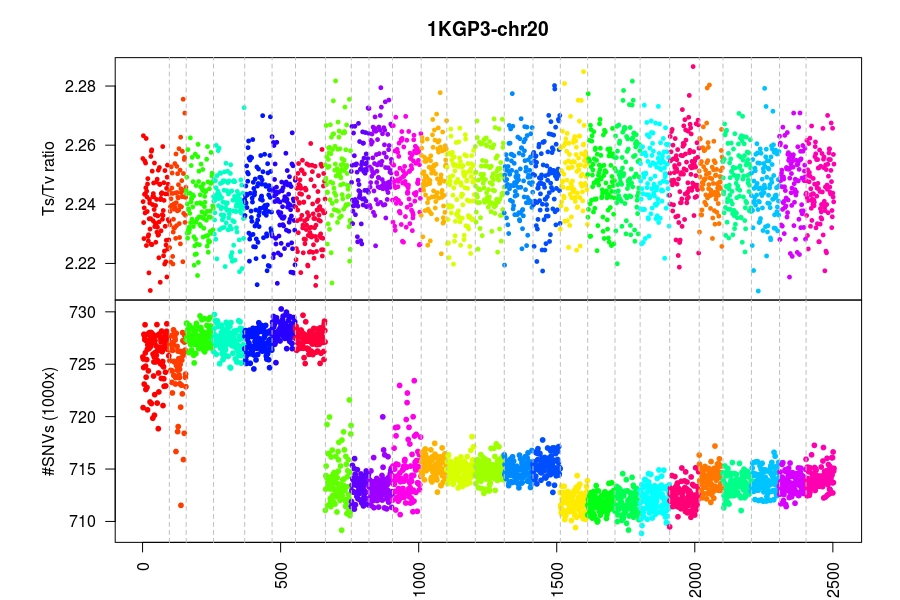
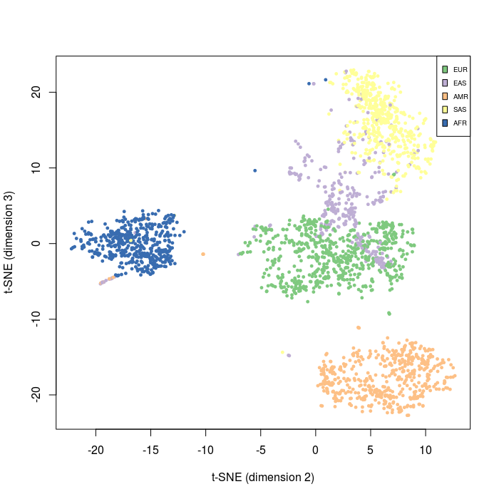

[](https://travis-ci.org/mklarqvist/tachyon)
[](https://github.com/mklarqvist/Tachyon/releases)
[](LICENSE)

<div align="center">
<br><br>
</div>

# Exploring population-scale sequence variant data
Tachyon, or `YON` for short, is an open source software library for storing and rapidly querying sequence variant data in an (optionally) lossless and bit-exact representation. It was developed with a focus on enabling fast experimentation and storage of population-scaled datasets. We have benchmarked Tachyon on population-scaled datasets up to 10 million whole-genome sequenced individuals (see [benchmarks](BENCHMARKS.md)). Most genotype-specific algorithms were originally developed for [Tomahawk][tomahawk] for the purpose of calculating all-vs-all linkage-disequilibrium and identity-by-state in large-scale cohorts.

## Highlights of Tachyon
* **Self-indexing**: Tachyon always builds the best possible quad-tree, linear, and meta-index given the input data (irrespective of sorting). There are no external indices as data are stored in the file itself.
* **Integrity checking**: The `YON` specification enforces validity checks for each data field and across all fields through checksum validation. This approach guarantees file integrity when compressing/decompressing and encrypting/decrypting. These checksums are stored internally.
* **Encryption**: Natively supports block-wise, field-wise, and entry-wise encryption with all commonly used encryption models and paradigms through [openssl][openssl].
* **Compression**: Tachyon files are generally many fold (in many cases many 10- to 100-folds) smaller than the current standard file-format.
* **Field-specific layout**: In principle, Tachyon is implemented as a standard column-oriented management system with several layers of domain-specific heuristics providing fast and flexible data queries. This memory layout enables extremely rapid field-specific queries.  
* **High-level API**: User-friendly C++/C API for quering, manipulating, and exploring sequence data with minimal programming experience
* **Comaptibility**: We strive to provide API calls to return YON data streams to any of the current standard file-formats (`VCF` and `BCF`). This allows for immediate use of Tachyon without disrupting the existing ecosystem of tools.

---

## Project status
Tachyon is under active development and the specification and/or the API interfaces may change at any time!   
**Commits may break functionality! THERE IS NO STABILITY PROMISE WHATSOEVER!**  

Current limitations imposed during development:
* Importing is restricted to `BCF`
* Output is restricted to `VCF`, `JSON`, and custom field slicing

---

## Table of contents
- [Getting started](#getting-started)
    - [Dependencies](#dependencies)
    - [Building from source](#building-from-source)
- [Workflow example: using the CLI](#workflow-example-using-the-cli)
    - [`import`: Importing `VCF`/`BCF`](#import-importing-vcfbcf)
    - [`view`: Viewing, converting, and slicing `YON` files](#view-viewing-converting-and-slicing-yon-files)
    - [Field-slicing](#field-slicing)
    - [Searching for genomic regions](#searching-for-genomic-regions)
    - [Annotating meta-data](#annotating-meta-data)
- [C++ API Examples](#c-api-examples)
    - [Standard containers](#standard-containers)
    - [Genotype containers / objects](#genotype-containers--objects)
    - [Math objects](#math-objects)
- [Author](#author)
- [Acknowledgements](#acknowledgements)
- [License](#license)
---

## Getting started
### Dependencies
You will need to have installed the following dependencies:
* [zstd][zstd]: A compression library developed at Facebook
* [openssl][openssl]: An open-source library for encryption/decryption

### Building from source
If the required dependencies listed above are installed then building is trivial. Note the added `--recursive` flag to the clone request. This flag is required to additionally clone the latest third-party dependencies.
```bash
git clone --recursive https://github.com/mklarqvist/tachyon
cd tachyon/build
make
```
If you have no super-user powers required to install `zstd` on your machine:
```
git clone --recursive https://github.com/mklarqvist/tachyon
cd tachyon
git clone https://github.com/facebook/zstd
cd zstd
make
cd lib/
cd ../build
make
```

## Workflow example: using the CLI
### `import`: Importing `VCF`/`BCF`
Import a `bcf` file to `yon` with a block-size of `-c` number of variants and/or `-C` number of base-pairs. If both `-c` and `-C` are set then the block breaks whenever either condition is satisfied. **Please note that importing VCF files are currently disabled**
```bash
tachyon import -i examples/example_dataset.bcf -o example_dataset.yon -c 2000
```

Tachyon can protect your sensitive identifying information with high-grade encryption. By default, each data field is encrypted separately in each block with different keys using AES-256. Simply pass the `-e` flag and the best practices will be used.
```bash
tachyon import -i examples/example_dataset.bcf -o example_dataset.yon -c 2000 -e
```
This will produce two output files:
* example_dataset.yon
* example_dataset.kyon

### `view`: Viewing, converting, and slicing `YON` files
Printing a `yon` file as a bit-exact copy of the input `VCF`
```bash
tachyon view -i example_dataset.yon -H
```
Output
```
Contig110_arrow	672	.	A	T	525.07	basic_filtering	AC=10;AF=0.217;AN=46;BaseQRankSum=0.967;DP=72;ExcessHet=0.8113;FS=54.73;InbreedingCoeff=-0.0525;MLEAC=11;MLEAF=0.239;MQ=31.05;MQRankSum=1.38;QD=18.11;ReadPosRankSum=-0.431;SOR=5.889	GT:AD:DP:GQ:PL	0/0:1,0:1:3:0,3,38	1/1:0,2:.:6:76,6,0	./.:0,0:0:.:0,0,0	0/1:2,2:.:43:58,0,43	0/0:1,0:1:3:0,3,24	0/0:4,0:4:12:0,12,141	./.:0,0:0:.:0,0,0	0/0:1,0:1:3:0,3,29	0/1:1,4:.:19:147,0,19	0/1:3,2:.:49:71,0,49	0/0:5,0:5:0:0,0,81	./.:1,0:1:.:0,0,0	./.:0,0:0:.:0,0,0	0/0:6,0:6:18:0,18,192	1/1:0,2:.:6:58,6,0	0/0:1,0:1:3:0,3,11	./.:1,0:1:.:0,0,0	./.:0,0:0:.:0,0,0	0/1:3,2:.:58:58,0,63	./.:0,0:0:.:0,0,0	0/0:4,0:4:12:0,12,134	0/0:3,0:3:0:0,0,44	0/0:3,0:3:9:0,9,90	./.:0,0:0:.:0,0,0	./.:0,0:0:.:0,0,0	./.:0,0:0:.:0,0,0	0/0:2,0:2:6:0,6,53	0/1:1,2:.:19:62,0,19	0/0:3,0:3:9:0,9,84	0/0:2,0:2:6:0,6,49	0/1:1,2:.:19:74,0,19	0/0:1,0:1:3:0,3,38	./.:2,0:2:.:0,0,0	./.:0,0:0:.:0,0,0	0/0:2,0:2:6:0,6,65	./.:0,0:0:.:0,0,0
```
We can check for bit-exact output from `tachyon` by comparing the output of the cryptographic hash function `SHA512` for `bcftools`. We drop the header `-H` as these two are different: both tools inject a timestamp and library versions each time a command is executed.
```bash
tachyon view -i example_dataset.yon -H | openssl dgst -sha512
```
```
4c94ee35fa3509935e5ea63f6da9b39dc94b1073b551c7d4d56bca7666a6872ad629b6f91f43a8dc45b306c0b0bbb2f414fb811ed45c7e6434c3570b2e448c68
```
```bash
bcftools view example_dataset.bcf -H | openssl dgst -sha512
```
```
4c94ee35fa3509935e5ea63f6da9b39dc94b1073b551c7d4d56bca7666a6872ad629b6f91f43a8dc45b306c0b0bbb2f414fb811ed45c7e6434c3570b2e448c68
```

Listing only site-specific information and `INFO` fields:
```bash
tachyon view -i example_dataset.yon -GH
```
Output
```
Contig110_arrow	672	.	A	T	525.07	basic_filtering	AC=10;AF=0.217;AN=46;BaseQRankSum=0.967;DP=72;ExcessHet=0.8113;FS=54.73;InbreedingCoeff=-0.0525;MLEAC=11;MLEAF=0.239;MQ=31.05;MQRankSum=1.38;QD=18.11;ReadPosRankSum=-0.431;SOR=5.889
```

### Field-slicing
Listing a specific `INFO` field with output data still adhering to the `VCF` specification:
```bash
tachyon view -i example_dataset.yon -GH -f "INFO=AC"
```
Output
```
Contig110_arrow	672	.	.	.	.	basic_filtering	AC=10
```

Add `REF` and `ALT` to the output
```bash
tachyon view -i example_dataset.yon -GH -f "INFO=AC;REF;ALT"
```
Output
```
Contig110_arrow	19575	.	A	C	.	basic_filtering	AC=2
```

Listing this output in a custom tab-delimited format
```bash
tachyon view -i example_dataset.yon -GH -f "INFO=AC;REF;ALT" -c -d'\t'
```
Output (first five lines)
```
A	T	10
A	T	36
TG	T	34
G	A	2
G	C	2
```

Listing `CHROM`, `POS`, and all `INFO` fields
```bash
tachyon view -i example_dataset.yon -GH -f "CHROM;POS;INFO" -c -d'|'
```
Output
```
Contig110_arrow|672|10|0.217|46|0.967|72|0.8113|54.73|-0.0525|11|0.239|31.05|1.38|18.11|-0.431|5.889
```

Listing all available `INFO` fields and the `FORMAT` fields `DP` and `PL` in VCF 
```bash
tachyon view -i example_dataset.yon -f "chrom;pos;ref;alt;info;format=dp,pl" -F vcf -H
```
Output
```
Contig110_arrow	672	.	A	T	.	basic_filtering	AC=10;AF=0.217;AN=46;BaseQRankSum=0.967;DP=72;ExcessHet=0.8113;FS=54.73;InbreedingCoeff=-0.0525;MLEAC=11;MLEAF=0.239;MQ=31.05;MQRankSum=1.38;QD=18.11;ReadPosRankSum=-0.431;SOR=5.889	DP:PL	1:0,3,38	.:76,6,0	0:0,0,0	.:58,0,43	1:0,3,24	4:0,12,141	0:0,0,0	1:0,3,29	.:147,0,19	.:71,0,49	5:0,0,81	1:0,0,0	0:0,0,0	6:0,18,192	.:58,6,0	1:0,3,11	1:0,0,0	0:0,0,0	.:58,0,63	0:0,0,0	4:0,12,134	3:0,0,44	3:0,9,90	0:0,0,0	0:0,0,0	0:0,0,0	2:0,6,53	.:62,0,19	3:0,9,84	2:0,6,49	.:74,0,19	1:0,3,38	2:0,0,0	0:0,0,0	2:0,6,65	0:0,0,0
```

Listing all available `INFO` fields and the `FORMAT` fields `DP` and `PL` in JSON
```bash
tachyon view -i example_dataset.yon -f "chrom;pos;ref;alt;info;format=dp,pl" -F JSON
```
Output
```json
"block": {
	"obj-0": {
		"contig": "Contig110_arrow",
		"position": 672,
		"ref": "A",
		"alt": "T",
		"INFO-AC": 10,
		"INFO-AF": 0.217,
		"INFO-AN": 46,
		"INFO-BaseQRankSum": 0.967,
		"INFO-DP": 72,
		"INFO-ExcessHet": 0.8113,
		"INFO-FS": 54.73,
		"INFO-InbreedingCoeff": -0.0525,
		"INFO-MLEAC": 11,
		"INFO-MLEAF": 0.239,
		"INFO-MQ": 31.05,
		"INFO-MQRankSum": 1.38,
		"INFO-QD": 18.11,
		"INFO-ReadPosRankSum": -0.431,
		"INFO-SOR": 5.889,
		"FORMAT-DP": [1, null, 0, null, 1, 4, 0, 1, null, null, 5, 1, 0, 6, null, 1, 1, 0, null, 0, 4, 3, 3, 0, 0, 0, 2, null, 3, 2, null, 1, 2, 0, 2, 0],
		"FORMAT-PL": [
			[0, 3, 38],
			[76, 6, 0],
			[0, 0, 0],
			[58, 0, 43],
			[0, 3, 24],
			[0, 12, 141],
			[0, 0, 0],
			[0, 3, 29],
			[147, 0, 19],
			[71, 0, 49],
			[0, 0, 81],
			[0, 0, 0],
			[0, 0, 0],
			[0, 18, 192],
			[58, 6, 0],
			[0, 3, 11],
			[0, 0, 0],
			[0, 0, 0],
			[58, 0, 63],
			[0, 0, 0],
			[0, 12, 134],
			[0, 0, 44],
			[0, 9, 90],
			[0, 0, 0],
			[0, 0, 0],
			[0, 0, 0],
			[0, 6, 53],
			[62, 0, 19],
			[0, 9, 84],
			[0, 6, 49],
			[74, 0, 19],
			[0, 3, 38],
			[0, 0, 0],
			[0, 0, 0],
			[0, 6, 65],
			[0, 0, 0]
		]
	},
```

Listing all available `INFO` fields and the `FORMAT` fields `DP` and `PL` in a custom output format with a tab-delimiter. No restrictions are placed on the output format
```bash
tachyon view -i example_dataset.yon -f "pos;info;format=dp,pl" -F CUSTOM -cd'\t'
```
Output
```
672	10	0.217	46	0.967	72	0.8113	54.73	-0.0525	11	0.239	31.05	1.38	18.11	-0.431	5.889	DP:PL	1:0,3,38	.:76,6,0	0:0,0,0	.:58,0,43	1:0,3,24	4:0,12,141	0:0,0,01:0,3,29	.:147,0,19	.:71,0,49	5:0,0,81	1:0,0,0	0:0,0,0	6:0,18,192	.:58,6,0	1:0,3,11	1:0,0,0	0:0,0,0	.:58,0,63	0:0,0,0	4:0,12,134	3:0,0,44	3:0,9,90	0:0,0,0	0:0,0,00:0,0,0	2:0,6,53	.:62,0,19	3:0,9,84	2:0,6,49	.:74,0,19	1:0,3,38	2:0,0,0	0:0,0,0	2:0,6,65	0:0,0,0
```

Listing all available `INFO` fields and the `FORMAT` fields `DP` and `PL` in a custom output format with a tab-delimiter and
all `FORMAT` data are printed as vectors of samples instead of per-sample
```bash
tachyon view -i example_dataset.yon -f "chrom;pos;ref;alt;info;format=dp,pl" -F CUSTOM -cd'\t' -V
```
Output
```
Contig110_arrow	672	A	T	10	0.217	46	0.967	72	0.8113	54.73	-0.0525	11	0.239	31.05	1.38	18.11	-0.431	5.889	DP:PL	1,.,0,.,1,4,0,1,.,.,5,1,0,6,.,1,1,0,.,0,4,3,3,0,0,0,2,.,3,2,.,1,2,0,2,0	0,3,38,76,6,0,0,0,0,58,0,43,0,3,24,0,12,141,0,0,0,0,3,29,147,0,19,71,0,49,0,0,81,0,0,0,0,0,0,0,18,192,58,6,0,0,3,11,0,0,0,0,0,0,58,0,63,0,0,0,0,12,134,0,0,44,0,9,90,0,0,0,0,0,0,0,0,0,0,6,53,62,0,19,0,9,84,0,6,49,74,0,19,0,3,38,0,0,0,0,0,0,0,6,65,0,0,0
```

Output all available `INFO` fields and the `FORMAT` field `DP` and `FILTERS`
```bash
tachyon view -i example_dataset.yon -f "chrom;pos;ref;alt;info;format=dp;filter" -F CUSTOM -cd';' -V
```

### Searching for genomic regions
Slicing intervals either as a contig, contig with a single position, or interval with a contig:
```bash
tachyon view -i example_dataset.yon -r "Contig110_arrow"
```
```bash
tachyon view -i example_dataset.yon -r "Contig110_arrow:672"
```
```bash
tachyon view -i example_dataset.yon -r "Contig110_arrow:672-1500"
```

### Annotating meta-data
It is possible to annotate data with a series of `INFO` fields computed directly from the genotypic vectors or from the reference/alternative allele data:

| Field           | Length | Type    | Description                                 |
|-----------------|--------|---------|---------------------------------------------|
| `FS_A`          | `A`      | `Float`   | PHRED-scaled Fisher's exact test P-value for allelic strand bias |
| `AN`            | `A`      | `Integer` | Total number of alleles in called genotypes |
| `NM`            | `A`      | `Integer` | Total number of missing alleles in called genotypes |
| `NPM`           | `A`      | `Integer` | Total number of samples with non-reference (compared to largest) ploidy |
| `AC`            | `A`      | `Integer` | Total number of alleles |
| `AC_FWD`        | `A`      | `Integer` | Total number of alleles on the *forward* strand |
| `AC_REV`        | `A`      | `Integer` | Total number of alleles on the *reverse* strand |
| `AF`            | `A`      | `Float`   | Allele frequency of allele |
| `HWE_P`         | `A`      | `Float`   | Hardy-Weinberg equilibrium P-value |
| `VT`            | `A`      | `String`  | Variant classification (SNP, MNP, INDEL, CLUMPED, SV, UNKNOWN) |
| `MULTI_ALLELIC` | 0        | `Flag`    | Indicates if a site is multi-allelic (number of alternative alleles > 1) |
| `F_PIC`         | `A`      | `Float`   | Population inbreeding coefficient (F-statistic) |

The contingency table, or matrix, for the Fisher's exact test (`FS_A` ) for strand bias looks like this:

|                | Target allele | *Not* target allele |
|----------------|---------------|-------------------|
| Forward strand | A             | B                 |
| Reverse strand | C             | D                 |

In the biallelic case, only one P-value is reported becuase of symmetry. If the site is not biallelic then each individual allele is computed separately. 

Using the example dataset, we can compute those fields that are not already available by passing the flag `-X`

```bash
tachyon view -i example_dataset.yon -GHX
```
Output
```
Contig110_arrow	672	.	A	T	525.07	basic_filtering	AC=10;AF=0.217;AN=46;BaseQRankSum=0.967;DP=72;ExcessHet=0.8113;FS=54.73;InbreedingCoeff=-0.0525;MLEAC=11;MLEAF=0.239;MQ=31.05;MQRankSum=1.38;QD=18.11;ReadPosRankSum=-0.431;SOR=5.889;FS_A=11.5091,0;NM=26;AC_FWD=21,2;AC_REV=15,8;HWE_P=0.25072;VT=SNP
```


## C++ API Examples
### Standard containers
```c++
/**<
 * Tachyon: https://github.com/mklarqvist/tachyon 
 * In this example we will load data from
 * the FORMAT field GL into the iterable template class
 * `FormatContainer`. This is a complete example!
 */
#include <tachyon/variant_reader.h>

std::string my_input_file = "somefile.yon"; // Change me to an actual file that exists on your filesystem
tachyon::VariantReader reader;
reader.getSettings().loadFormat("GL");
reader.open(my_input_file);

/**<
 *  The `FormatContainer` class stores the data for each variant 
 *  for each individual as container[variant][sample][data]
 */
while(reader.nextBlock()){ // As long as there are YON blocks available
    // Meta container
    containers::MetaContainer meta(reader.block);
    // FORMAT container with float return type primitive
    containers::FormatContainer<float>* gp_container = reader.get_balanced_format_container<float>("GL", meta);
    if(gp_container != nullptr){
        for(U32 variant = 0; variant < gp_container->size(); ++variant){
            for(U32 sample = 0; sample < gp_container->at(variant).size(); ++sample){
                // Write the data to `cout` in `VCF` formatting
                utility::to_vcf_string(std::cout, gp_container->at(variant).at(sample)) << ' ';
            }
            std::cout << '\n';
        }
        std::cout << '\n';
    }
    delete gp_container;
}
```

```c++
/**<
 * Tachyon: https://github.com/mklarqvist/tachyon 
 * In this example we will load data from
 * the INFO field SVLEN into the iterable template class
 * `InfoContainer`. This is a complete example!
 */
#include <tachyon/variant_reader.h>

std::string my_input_file = "somefile.yon"; // Change me to an actual file that exists on your filesystem
tachyon::VariantReader reader;
reader.getSettings().loadInfo("SVLEN");
reader.open(my_input_file);

/**<
 * The `InfoContainer` class stores the data for each variant as
 * container[variant][data]. Both `InfoContainer` and `FormatContainer`
 * supports variant-balancing of the classes. Balancing refers to filling
 * variant sites in the file with empty objects if no target data is present
 * at that site.
 */
while(reader.nextBlock()){ // As long as there are YON blocks available
    // Meta container
    containers::MetaContainer meta(reader.block);
    // Variant-balanced
    containers::InfoContainer<U32>* info_balanced   = reader.get_balanced_info_container<U32>("SVLEN", meta);
    // Not variant-balanced 
    containers::InfoContainer<U32>* info_unbalanced = reader.get_info_container<U32>("SVLEN");
    // Print the sizes of the two containers
    // The size of the balanced container is always the number of variants
    // In contrast, the unbalanced one returns a container only for the 
    // variants with data available. 
    std::cout << info_balanced->size() << "/" << info_unbalanced->size() << '\n';
    delete info_balanced;
    delete info_unbalanced;
}
```

```c++
/**<
 * Tachyon: https://github.com/mklarqvist/tachyon 
 * In this example we will load data from
 * the INFO field MEINFO into the iterable template class
 * `InfoContainer`. This is a complete example!
 */
#include <tachyon/variant_reader.h>

std::string my_input_file = "somefile.yon"; // Change me to an actual file that exists on your filesystem
tachyon::VariantReader reader;
reader.getSettings().loadInfo("MEINFO");
reader.open(my_input_file);

/**<
 * The `InfoContainer` class has to be templated as std::string if the underlying data is of type `char`
 */
while(reader.nextBlock()){ // As long as there are YON blocks available
    // Meta container
    containers::MetaContainer meta(reader.block);
    containers::InfoContainer<std::string>* meinfo_container = reader.get_balanced_info_container<std::string>("MEINFO", meta);
    std::cout << meinfo_container->size() << std::endl;
    delete meinfo_container;
}
```

```c++
/**<
 * Tachyon: https://github.com/mklarqvist/tachyon 
 * In this example we will load data from
 * the VEP-generated CSQ string and tokenize it using
 * built-in utility functions
 */
#include <tachyon/variant_reader.h>

std::string my_input_file = "somefile.yon"; // Change me to an actual file that exists on your filesystem
tachyon::VariantReader reader;
reader.getSettings().loadInfo("CSQ");
reader.open(my_input_file);

while(reader.nextBlock()){ // As long as there are YON blocks available
    containers::MetaContainer meta(reader.block);
    containers::InfoContainer<std::string>* csq_data = reader.get_balanced_info_container<U32>("std::string", meta);
    if(it2 != nullptr){
        for(size_t i = 0; i < csq_data->size(); ++i){
            if(csq_data->at(i).size() == 0) continue;
            else {
                meta.at(i).toVCFString(std::cout, this->header);
                std::cout.put('\t');
                // Tokenize CSQ string into a vector of strings
                std::vector<std::string> ret = utility::split((*csq_data)[i],'|');
                // Dump element 6 out of ret.size() total elements
                std::cout << ret[6] << "\n";
            }
        }
    }
    delete csq_data;
}
```

---

### Genotype containers / objects
```c++
/**<
* Tachyon: https://github.com/mklarqvist/tachyon 
* The higher-order primitive GTObject allows for single-genotype
* manipulation whenever summary statistics is insufficient. There
* are three levels of return types:
* 1) The literal internal representation (preffered use). This
*    function returns the implementation representation as a generic
*    GTObject. 
* 2) Unpacked (one genotype -> one sample) GTObject but in permuted
*    order. These genotypes are in the internal sorted order and does
*    not match with the tachyon sample header
* 3) Unpacked (one genotype -> one sample) GTObject in original order.
*    These genotype objects are returned in the same order as described
*    in the tachyon sample header. 
*
* This is a complete example!
*/
#include <tachyon/variant_reader.h>

std::string my_input_file = "somefile.yon"; // Change me to an actual file that exists on your filesystem
tachyon::VariantReader reader;
reader.getSettings().loadGenotypes(true);
reader.open(my_input_file);

while(reader.nextBlock()){ // As long as there are YON blocks available
    containers::GenotypeContainer gt(reader.block);
    for(U32 i = 0; i < gt.size(); ++i){
        // All of these functions are in relative terms very expensive!
        // Avoid using them unless you absolutely have to!
        // Vector of literal genotype representations (lower level)
        std::vector<core::GTObject> objects     = gt[i].getLiteralObjects();
        // Vector of genotype objects (high level permuted)
        std::vector<core::GTObject> objects_all = gt[i].getObjects(reader.header.getSampleNumber());
        // Vector of genotype objects (high level unpermuted - original)
        std::vector<core::GTObject> objects_true = gt[i].getObjects(reader.header.getSampleNumber(), reader.block.ppa_manager);

        // Print the difference
        std::cerr << objects.size() << '\t' << objects_all.size() << '\t' << objects_true.size() << std::endl;
        // Dump data
        gt[i].getMeta().toVCFString(std::cout, reader.header, reader.block.index_entry.contigID, reader.block.index_entry.minPosition);
        utility::to_vcf_string(std::cout, objects_true) << '\n';
    }
}
```

More advanced example using genotype summary statistics
```c++
/**<
* Tachyon: https://github.com/mklarqvist/tachyon 
* In this example we will use the genotype summary statistics
* to calculate strand-specific bias of an alelle using a Fisher's 
* 2x2 exact test. This is a complete example!
*/
#include <tachyon/variant_reader.h>

std::string my_input_file = "somefile.yon"; // Change me to an actual file that exists on your filesystem
tachyon::VariantReader reader;
reader.getSettings().loadGenotypes(true);
reader.open(my_input_file);

while(reader.nextBlock()){ // As long as there are YON blocks available
    containers::GenotypeContainer gt(reader.block);
    math::Fisher fisher(); // Math class for Fisher's exact test and Chi-squared
    containers::GenotypeSum gt_summary; // Genotype summary statistics
    for(U32 i = 0; i < gt.size(); ++i){ // Foreach variant
        // If there's > 5 alleles continue
        if(gt[i].getMeta().getNumberAlleles() >= 5) continue;
        // Calculate summary statistics
        gt[i].getSummary(gt_summary);

        // Calculate total number of alt-alleles (allele 1, where 0 is ref)
        const U64 total = gt_summary.getAlleleA(1) + gt_summary.getAlleleB(1);
        const double p = fisher.fisherTest(gt_summary.getAlleleA(1), total, gt_summary.getAlleleB(1), total); // P-value for allele-bias
        if(p < 1e-3){ // If P < 0.001 report it
            gt[i].getMeta().toVCFString(std::cout, reader.header, reader.block.index_entry.contigID, reader.block.index_entry.minPosition);
            std::cout << '\t' << gt_summary << '\t' << p << '\t' << ((gt_summary.getAlleleA(1) == 0 || gt_summary.getAlleleB(1) == 0) ? 1 : 0) << '\n';
        }
        gt_summary.clear(); // Recycle summary object
    }
}
```

Calculating Ts/Tv ratio and other summary statistics
```c++
/**<
* Tachyon: https://github.com/mklarqvist/tachyon 
* In we will calculate the transition-to-transversion ratio and other
* summary statistics. This is a complete example!
*/
#include <tachyon/variant_reader.h>

std::string my_input_file = "somefile.yon"; // Change me to an actual file that exists on your filesystem
tachyon::VariantReader reader;
reader.getSettings().loadGenotypes(true);
reader.open(my_input_file);

std::vector<tachyon::core::TsTvObject> global_titv(reader.header.getSampleNumber()); // Global summary object
while(reader.nextBlock()){ // As long as there are YON blocks available
    containers::GenotypeContainer gt(this->block);
    std::vector<tachyon::core::TsTvObject> objects(this->header.getSampleNumber()); // Local summary objects
    for(U32 i = 0; i < gt.size(); ++i)
        gt[i].getTsTv(objects); // Update summary statistics for each variant site

    for(U32 i = 0; i < objects.size(); ++i)
        global[this->block.ppa_manager[i]] += objects[i]; // Update global object with unpermuted sample order
}

// Dump data to standard out
std::cout << "Sample\tTransversions\tTransitions\tTiTV\tAA\tAT\tAG\tAC\tTA\tTG\tTC\tTT\tGA\tGT\tGG\tGC\tCA\tCT\tCG\tCC\totalVariants\n";
for(U32 i = 0; i < global_titv.size(); ++i)
    std::cout << reader.header.samples[i].name << '\t' << global_titv[i] << '\n';

```

This will generate a tab-delimited output table (first three rows shown here) 
 
| Sample | Transversions | Transitions | TsTV    | AA     | AT   | AG    | AC   | TA   | TG     | TC   | TT    | GA    | GT   | GG      | GC   | CA   | CT    | CG   | CC      |  
|--------|---------------|-------------|---------|--------|------|-------|------|------|--------|------|-------|-------|------|---------|------|------|-------|------|---------|  
| 0      | 30385         | 68543       | 2.25582 | 649609 | 3183 | 17281 | 3849 | 3109 | 629125 | 4055 | 17041 | 17267 | 4009 | 1061887 | 4237 | 3897 | 16954 | 4046 | 1052277 |  
| 1      | 30744         | 68996       | 2.24421 | 649463 | 3231 | 17349 | 3885 | 3092 | 628986 | 4026 | 17192 | 17509 | 4065 | 1061550 | 4282 | 4037 | 16946 | 4126 | 1052089 |  
| 2      | 31003         | 70163       | 2.2631  | 649048 | 3282 | 17682 | 3894 | 3075 | 628845 | 4099 | 17265 | 17826 | 4160 | 1060990 | 4412 | 4013 | 17390 | 4068 | 1051703 |  

An example plot in `R`


---

### Math objects
```c++
/**<
* Tachyon: https://github.com/mklarqvist/tachyon 
* In this example we will calculate the identity-by-descent
* between samples using the math::SquareMatrix object.
*
* This is a complete example!
*/
#include <tachyon/variant_reader.h>

std::string my_input_file = "somefile.yon"; // Change me to an actual file that exists on your filesystem
tachyon::VariantReader reader;
reader.getSettings().loadGenotypes(true);
reader.open(my_input_file);

// Allocate two matrices of size N*N
// The second object is a temporary matrix used when
// genotype data is permuted.
tachyon::math::SquareMatrix<double> square(reader.header.getSampleNumber());
tachyon::math::SquareMatrix<double> square_temporary(reader.header.getSampleNumber());
U64 n_alleles = 0;
while(reader.nextBlock()){ // As long as there are YON blocks available
    containers::GenotypeContainer gt(reader.block);
    // Compare genotypes pairwise for each M in the current YON block
    for(U32 i = 0; i < gt.size(); ++i)
        gt[i].comparePairwise(square_temporary);

    // Add the data from the temporary matrix to the main matrix
    // in the unpermuted genotype order
    square.addUpperTriagonal(square_temporary, reader.block.ppa_manager);
    square_temporary.clear(); // Recycle memory

    // 2 * (Upper triagonal + diagonal) * number of variants
    // This is equivalent to (choose(N, 2) + N) * M_block
    const U64 updates = 2*((reader.header.getSampleNumber()*reader.header.getSampleNumber() - reader.header.getSampleNumber())/2 + reader.header.getSampleNumber()) * gt.size();
    n_aleles += 2*reader.header.getSampleNumber()*gt.size(); // 2*N*M_block
}
square /= n_alleles; // Divide matrix by the number of observed alleles
std::cout << square << std::endl; // Print output
```
Lets plot this output matrix in `R`
```R
# In this example we have pre-computed the identity-by-state
# matrix for the 2,504 samples from the 1000 genomes project
# using genotypes from chromosme 20.
# Calculating this matrix takes roughly ~1 hour on a single
# core on a laptop
#
# Upper triagonal similiary
diff<-read.delim("1kgp3_chr20_ibs_matrix.txt",h=F)
# Square matrix
diff2<-matrix(0,ncol(diff)-1,ncol(diff)-1)

# Utility function to convert upper triagonal matrix into
# square matrix with empty diagonal removed
helper<-function(dataset,position){ t(dataset[position,-position])+dataset[-position,position] }
for(i in 1:(ncol(diff)-1)) diff2[,i]<-helper(diff,i)

# Load sample meta data (including labels)
# Available online at http://www.internationalgenome.org/
groupings<-read.delim("integrated_call_samples_v3.20130502.ALL.panel")

# Generate some colours
library(RColorBrewer)
#colors = rainbow(length(unique(groupings$super_pop)))
colors = brewer.pal(length(unique(groupings$super_pop)), "Accent")
names(colors) = unique(groupings$super_pop)

# Load and run t-SNE with various perplexities
library(Rtsne)
tsneP10 <- Rtsne(diff2, dims = 5, perplexity=10,verbose=TRUE, max_iter = 500)
tsneP20 <- Rtsne(diff2, dims = 5, perplexity=20,verbose=TRUE, max_iter = 500)
tsneP30 <- Rtsne(diff2, dims = 5, perplexity=30,verbose=TRUE, max_iter = 500)
tsneP40 <- Rtsne(diff2, dims = 5, perplexity=40,verbose=TRUE, max_iter = 500)
tsneP50 <- Rtsne(diff2, dims = 5, perplexity=50,verbose=TRUE, max_iter = 500)

# Plot some data
plot(tsneP10$Y[,1],tsneP10$Y[,2],pch=20,cex=.8,col=colors[groupings$super_pop])
legend("topright",legend = names(colors),fill=colors,cex=.6)
plot(tsneP20$Y[,1],tsneP20$Y[,2],pch=20,cex=.8,col=colors[groupings$super_pop])
legend("topright",legend = names(colors),fill=colors,cex=.6)
plot(tsneP30$Y[,1],tsneP30$Y[,2],pch=20,cex=.8,col=colors[groupings$super_pop])
legend("topright",legend = names(colors),fill=colors,cex=.6)
plot(tsneP40$Y[,1],tsneP40$Y[,2],pch=20,cex=.8,col=colors[groupings$super_pop])
legend("topright",legend = names(colors),fill=colors,cex=.6)
plot(tsneP50$Y[,1],tsneP50$Y[,2],pch=20,cex=.8,col=colors[groupings$super_pop])
legend("topright",legend = names(colors),fill=colors,cex=.6)
```
Generated output  


### Author
Marcus D. R. Klarqvist (<mk819@cam.ac.uk>)  
Department of Genetics, University of Cambridge  
Wellcome Trust Sanger Institute

### Acknowledgements
[James Bonfield](https://github.com/jkbonfield), Wellcome Trust Sanger Institute  
[Petr Daněček](https://github.com/pd3), Wellcome Trust Sanger Institute  
[Richard Durbin](https://github.com/richarddurbin), Wellcome Trust Sanger Institute, and Department of Genetics, University of Cambridge  

### License
Tachyon is licensed under [MIT](LICENSE)


[openssl]:  https://www.openssl.org/
[zstd]:     https://github.com/facebook/zstd
[tomahawk]: https://github.com/mklarqvist/tomahawk
[msprime]:  https://github.com/jeromekelleher/msprime